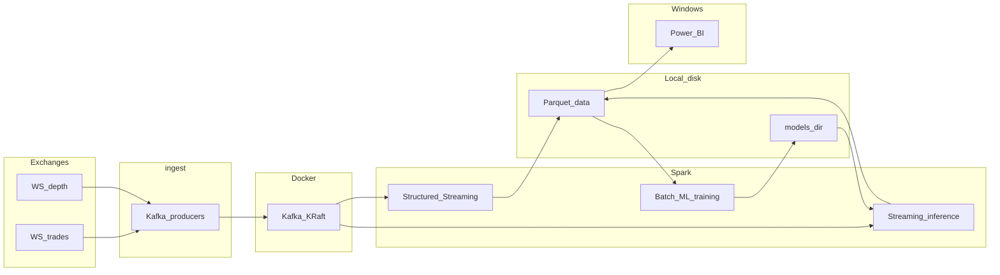

# contexto.md — Bootstrap para proyecto: Cripto HF + Kafka + Spark (CPU vs GPU)

Este documento es la **fuente de verdad** para iniciar un **nuevo repositorio** (o regenerar `CLAUDE.md` en limpio). Está pensado para copiarse a otro directorio y pegarse el **Prompt maestro** (final del archivo) en Claude/Cursor.

**Regla dura para asistentes:** no inventar stack alternativo (Databricks, Colab, S3, Postgres, etc.) salvo que el usuario lo pida explícitamente. Las elecciones están fijadas abajo.

---

## 1. Meta de este documento

- Humanos: entender alcance, entregables y límites técnicos del curso.
- LLM: generar `CLAUDE.md`, READMEs por dominio, `.env.example` y plan de implementación **sin contradicciones**.

---

## 2. Contexto académico

- **Curso / institución:** ITAM — Arquitectura de Grandes Volúmenes de Datos (referencia de proyecto tipo “GVD”).
- **Objetivo académico principal:** comparar **Apache Spark Structured Streaming** en **CPU** vs **GPU** (NVIDIA **RAPIDS Accelerator for Apache Spark**, `rapids-4-spark`) **en la misma máquina local** (típicamente **WSL2 Ubuntu** en Windows), midiendo throughput y tiempos con **Spark Application UI** (`http://localhost:4040`).
- **Entregables típicos:** capturas de Spark UI, tabla comparativa CPU vs GPU, carpeta `reports/<fecha>/<modo>_…/`, y dashboard en **Power BI Desktop** (Windows) leyendo **Parquet** generado en WSL.

---

## 3. Descripción del proyecto (dominio: finanzas / cripto alta frecuencia)

**Nombre de trabajo:** Análisis multivariado de criptoactivos en alta frecuencia.

**Qué se construye:**

1. **Captura masiva:** flujo continuo de **trades** y **actualizaciones de libro de órdenes** (order book / depth) desde uno o más exchanges vía **WebSocket**, para **al menos 10 pares** (ej. BTC/USDT, ETH/USDT, SOL/USDT y otros de alta liquidez).
2. **Umbral de volumen (referencia):** diseñar el pipeline para soportar del orden de **> 4 000 lecturas/mensajes por segundo** agregadas en experimentos (la cifra exacta depende del exchange y del modo de suscripción; debe **medirse** y documentarse por topic/corrida).
3. **Transporte:** todos los productores publican a **Apache Kafka** con un **JSON envelope** único (ver sección 6).
4. **Procesamiento online (no supervisado):**
   - Ventanas de tiempo + **watermark** en Spark.
   - Estadísticos en ventana: **VWAP**, **volatilidad móvil**, agregados de volumen y spread proxies según disponibilidad de datos.
   - **Detección de anomalías:** implementar **STREAM-LOF** o **DBSCAN online** de forma **documentada y realista**: típicamente sobre **vectores de features por ventana** (p. ej. 1 s / 5 s) y/o **baja dimensionalidad**, con **muestreo** si el throughput lo exige. No prometer LOF exacto sobre cada tick sin cuantificar costo.
5. **Almacenamiento:** **Parquet** en disco local (`~/data/crypto/` en WSL o equivalente).
6. **Entrenamiento batch:** modelo de **clasificación** (ej. **Random Forest** o **Gradient Boosting** en MLlib u otra librería acordada **dentro de Python/Spark**, sin saltar a servicios cloud) para predecir si el precio **sube o baja** en la **siguiente ventana de 5 minutos**, usando features derivadas de ventanas previas.
7. **Inferencia en tiempo real:** reaplicar el modelo a features streaming y escribir salidas consultables (Parquet y/o topic `crypto-pred`), para **Power BI** u otro dashboard permitido.

**Visualización:** por defecto **Power BI Desktop** en Windows; Tableau solo si el curso lo permite explícitamente.

---

## 4. Stack técnico (fijo)

| Pieza | Elección |
| ----- | -------- |
| Lenguaje | Python **3.11+** (recomendado 3.11 en WSL por wheels). |
| Spark | **3.5.x** (`pyspark==3.5.*`). Pin CPU / streaming: **3.5.4**. Para jobs **GPU + RAPIDS** usar **3.5.2** (parche anterior estable alineado con `rapids-4-spark_2.12-24.10.1` y dependencias Maven). |
| Kafka | **Docker**, **único** servicio en Compose; modo **KRaft** (sin Zookeeper). Imagen de referencia: `confluentinc/cp-kafka:7.6.1` (`infra/docker-compose.kafka.yml`). |
| GPU Spark | **rapids-4-spark 24.10.1** (`rapids-4-spark_2.12-24.10.1.jar`) con **Spark/PySpark 3.5.2** + **CUDA 12.x** en WSL (no confundir con el número de CUDA que muestra `nvidia-smi` en Windows). Este proyecto **no** usa Redis; mensajería = Kafka. |
| Ingesta | **asyncio** + cliente **WebSocket** (ej. `websockets`) → productor Kafka (`kafka-python` o `confluent-kafka`). Opcional: **FastAPI** solo para **health/metrics** (no es obligatorio para la ingesta). |
| Estado / secretos | **Sin Postgres** por defecto. **SQLite** opcional para offsets/cursors fuera de Spark si hace falta. API keys de exchange solo si se usa REST privado (no requerido para datos públicos de libro/trades). |
| Datos locales | Parquet bajo `~/data/crypto/` (WSL); Power BI lee vía `\\wsl$\Ubuntu\home\<usuario>\data\crypto`. |
| ML | **Spark MLlib** preferido para alineación con el curso; justificar cualquier dependencia extra. |

---

## 5. Arquitectura de referencia



**Replayer (estrés / reproducibilidad):** script en `spark/replayer/` para leer Parquet histórico y **inyectar a Kafka** a alta velocidad, permitiendo repetir la misma carga para comparar CPU vs GPU.

---

## 6. Contrato Kafka (obligatorio)

### 6.1 Topics (convención recomendada)

Usar **topics por tipo de evento** (evita explosión de topics por par):

| Topic | Contenido |
| ----- | ----------- |
| `crypto-trades` | Ejecuciones agregadas / trades normalizados |
| `crypto-book` | Actualizaciones de libro (snapshots o deltas según diseño) |
| `crypto-features` | Features por ventana (salida de Spark u otro stage acordado) |
| `crypto-pred` | Predicciones / scores del modelo |

**Particiones:** **8** por topic en desarrollo (ajustable); **replication-factor = 1** (broker único).

### 6.2 Envelope JSON (un mensaje = un objeto JSON UTF-8)

Campos mínimos:

| Campo | Tipo | Descripción |
| ----- | ---- | ----------- |
| `symbol` | string | Ej. `BTCUSDT` o `BTC/USDT` (fijar una convención y usarla siempre). |
| `exchange` | string | Ej. `binance`, `kraken`. |
| `event_type` | string | Ej. `trade`, `book_ticker`, `depth_update`, `feature_row`, `prediction`. |
| `ts_event` | string | ISO-8601 UTC del evento en origen si existe; si no, mejor esfuerzo. |
| `ts_ingest` | string | ISO-8601 UTC de ingesta al sistema. |
| `payload` | object | Carga útil normalizada (precio, cantidad, niveles de libro, etc.). |

Los consumidores Spark deben parsear el envelope y extraer claves temporales para **watermark** (`ts_event` preferido).

---

## 7. Reglas Spark / Kafka (procesamiento)

1. Agregaciones temporales: `window(...)` + `withWatermark(...)` sobre campo temporal consistente.
2. **`checkpointLocation` distinto** por cada query de streaming.
3. Comparación CPU vs GPU: mismos datos (mismo replay) y mismos parámetros de negocio; cambian `spark-cpu.conf` / `spark-gpu.conf` y jars RAPIDS. En este repo el pin GPU usa **PySpark 3.5.2** + **rapids-4-spark 24.10.1** y el pin CPU **3.5.4** (documentado en `CLAUDE.md`).
4. Métricas a documentar bajo `reports/…`: Input Rate, Processing Rate, Batch Duration (p95), cola de batches, Shuffle Read/Write, GC Time, Scheduler Delay, Spill, etc.

---

## 8. Infraestructura y WSL

- **Host:** Windows 10/11 + **WSL2** (Ubuntu LTS recomendado).
- **GPU:** driver NVIDIA en **Windows**; en WSL instalar **CUDA toolkit 12.x** y librerías necesarias para RAPIDS según documentación NVIDIA. **No** instalar `nvidia-driver-*` dentro de WSL con `apt` (rompe el passthrough).
- Scripts canónicos en `infra/scripts/`: crear topics, ejecutar Spark CPU/GPU, opcional `install_cuda12_wsl.sh` si el repo lo incluye.

---

## 9. Cumplimiento y uso de datos

- Respetar **Términos de Servicio** del exchange (Binance, Kraken, etc.): uso académico, sin redistribución pública de feeds crudos, rate limits y políticas de IP/WebSocket.
- No commitear claves, `.env` real ni datasets grandes.

---

## 10. Estructura de repositorio sugerida

```
PROYECTO/
  ingest/              # Productores WebSocket → Kafka (reemplaza backend WHOOP)
  spark/jobs/          # Structured Streaming, batch training, inferencia
  spark/replayer/      # Replay Parquet → Kafka
  spark/conf/          # spark-cpu.conf / spark-gpu.conf
  infra/
    docker-compose.kafka.yml
    scripts/
  data/                # gitignored — Parquet local
  models/              # gitignored — modelos entrenados
  reports/             # capturas Spark UI, tablas comparativas
  CLAUDE.md            # generado a partir de este contexto y READMEs
  contexto.md          # este archivo (opcional mantenerlo copiado en el nuevo repo)
```

---

## 11. Lista explícita: no usar (salvo petición explícita del usuario)

- Google Colab, ngrok, Google Drive como “datalake”.
- **Amazon S3 / object storage cloud** como ruta principal de datos.
- **Postgres** u otra BD operacional por defecto.
- Cambiar Kafka por Pulsar/Kinesis **salvo** requisito docente explícito.
- Ignorar comparativa CPU/GPU si el curso la exige (este documento la **exige**).

---

## 12. Datos que el humano debe proveer antes de corridas serias

- Lista final de **pares** y **exchange(s)**.
- **RAM** del host (para `spark.driver.memory`, shuffle, Kafka heap).
- Confirmación de **CUDA 12.x** en WSL y versión compatible **rapids-4-spark** para Spark 3.5.x.
- Criterio de éxito del throughput (por ejemplo mensajes/s sostenidos por 5 min).

---

## 13. Checklist para generar `CLAUDE.md` en el nuevo repo

- [ ] Título y propósito: asistentes deben leer READMEs por dominio (`ingest/`, `spark/`, `infra/`).
- [ ] Contexto académico y objetivo CPU vs GPU + Spark UI + Power BI.
- [ ] Tabla de stack fijo (sección 4 de este archivo).
- [ ] Diagrama o referencia a arquitectura (sección 5).
- [ ] Topics Kafka + envelope JSON (sección 6).
- [ ] Reglas Spark: watermark, checkpoints, replay (sección 7).
- [ ] Versiones pin: Python 3.11, Spark 3.5.x, CUDA 12.x, rapids-4-spark.
- [ ] Estructura de carpetas (sección 10).
- [ ] “No usar” (sección 11).
- [ ] Convenciones de código: type hints, formatter/lint, tests con mocks de Kafka, dependencias justificadas.

---

## 14. Prompt maestro (copiar y pegar en el nuevo directorio)

```
Eres un asistente de código en un repositorio nuevo para el curso ITAM Arquitectura de Grandes Volúmenes de Datos.

FUENTE DE VERDAD: lee el archivo contexto.md en la raíz del repo (si no existe, pídelo al usuario). No inventes stack alternativo: usa solo lo definido ahí (Kafka en Docker KRaft, Spark 3.5.x Structured Streaming, PySpark, comparativa CPU vs GPU con rapids-4-spark y CUDA 12.x en WSL2, Parquet local ~/data/crypto/, Power BI Desktop leyendo Parquet por \\wsl$\...).

TAREA (orden estricto):
1) Crear o sobrescribir CLAUDE.md en la raíz, en español, con el mismo tipo de secciones que un proyecto GVD profesional: índice a ingest/README.md, spark/README.md, infra/README.md; contexto académico; tabla de stack fijo; estructura de carpetas; topics Kafka y envelope JSON obligatorio (symbol, exchange, event_type, ts_event, ts_ingest, payload); reglas Spark (watermark, checkpoint por query); versiones pin; lista "no usar"; convenciones de código.
2) Crear ingest/README.md con modelo de ingesta WebSocket→Kafka, límites del exchange, normalización de símbolos, y política de reintentos/reconexión a alto nivel.
3) Crear spark/README.md con lista de topics (crypto-trades, crypto-book, crypto-features, crypto-pred), particiones recomendadas, métricas para reports/, y separación streaming vs batch vs inferencia.
4) Crear o actualizar infra/README.md con Docker solo Kafka, comandos WSL para topics y run_spark_cpu/gpu, nota de no instalar drivers NVIDIA dentro de WSL.
5) Crear .env.example con variables: KAFKA_BOOTSTRAP, topics opcionales, EXCHANGE_DEFAULT, SYMBOLS (lista separada por comas), WEBSOCKET_* si aplica, SPARK_CHECKPOINT_BASE, DATA_DIR, MODEL_DIR — sin secretos reales.

NO implementes aún productores Spark ni código de ingesta salvo que el usuario pida explícitamente la siguiente fase. Prioriza documentación consistente y sin contradicciones.

Al terminar, lista brevemente los archivos tocados y cualquier supuesto que hayas debido hacer (si algo en contexto.md estaba incompleto, dilo).
```

---

## 15. Nota sobre el proyecto anterior

Este contexto sustituye el enfoque previo basado en **WHOOP + OAuth multi-usuario**. La ingesta pasa a ser **WebSocket desde exchanges**; no hay `app_user_id` ni tokens OAuth salvo que más adelante se use API privada.
